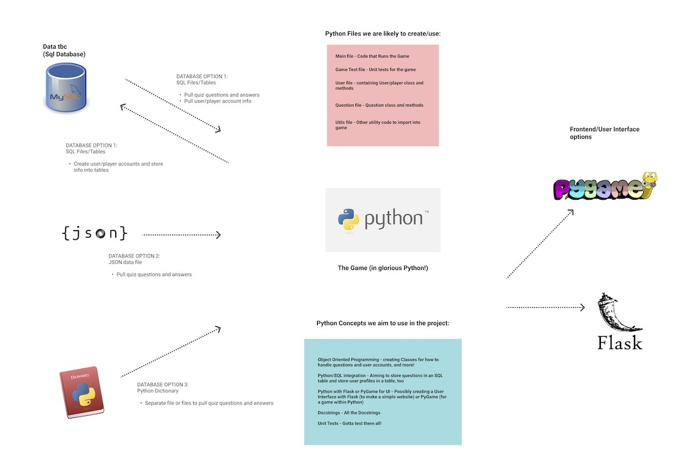

1. What are you building?

    - We are building a multiple choice quiz game to help users learn and revise concepts in Python using Object-Oriented Programming. 

2. What does it do or what kind of problem does it solve?
    
    - It will ask the user a series of questions related to python and give them a score to test their knowledge.
    - It will highlight areas that the user may want to review based on wrong answers they submit and allow them to try the question again at the end of the quiz.
    - The game aims to reinforce learning Python in a fun, quick and enjoyable way.

3. What are key features of your system?
    - Users will log in with a username and password
    - The game will present multiple choice questions to the user based on Python
    - inform the user of the correct answer once the answer is selected
    - it will calculate the user's score
    - it will tell the user when they have submitted a wrong answer, reveal the correct answer and let them try again at the end of the quiz
    

    We may also include the following features:
    - timer option that can be turned on and off
    - hints
    - a pygame or flask user interface
    - storing the questions and answers in a database
    - different difficulty modes
    - highscores
   

4. Provide a sample architecture diagram of your system (you can use PPT with squares and circles to demonstrate a simplified flow of you system)

5. Describe the team approach to the project work: how are you planning to distribute the workload, how are you managing your code, how are you planning to test your system?

    - We are using slack, trello and Google Drive to manage our workload and keep everyone up to date on progress and our ideas.
    - We distribute the workload between us according to preference and time capacity each week.
    - We plan to have frequent, shorter meetings as trello and Slack will allow us to keep updated with each other. We have already had two meetings discussing the features of our game and packages we consider using.
    - We are prioritising features that are 'must haves' vs. 'nice to haves'
    - Our code is managed on GitHub, we plan to use git branches and pull requests to add to and amend our code.
    - We plan to use unit tests to test our system to make sure our methods run as desired.